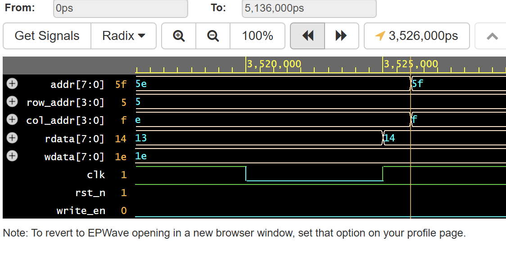
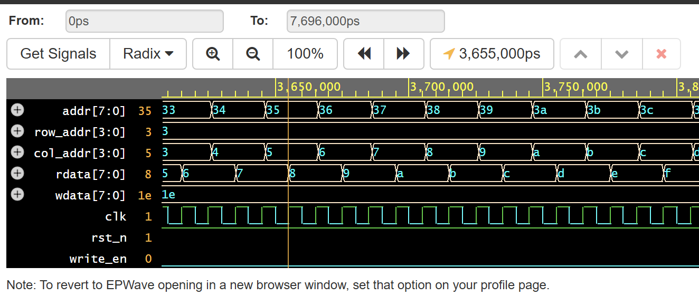

# DRAM Row & Column Addressing Model

[English](#english-version) | [한국어](#한국어-버전)

---

## 1. Project Overview (English)
Building upon the basic DRAM controller, this project implements a **2D Matrix structure** to model how memory cells are physically organized and accessed. I focused on translating the 1D logical address into **Row and Column addresses**, mimicking the actual Wordline(WL) and Bitline(BL) selection process in DRAM layouts.

## 2. Key Features
* **Address Decoding:** Splitting an 8-bit input address into Row[7:4] and Column[3:0].
* **Matrix Modeling:** Implementation of a 16x16 (256-cell) memory array.
* **Structural Abstraction:** Modeling the physical intersection of Wordlines and Bitlines using SystemVerilog multi-dimensional arrays.

## 3. Design & Logical Mapping
* **Row Address (MSB 4-bit):** Acts as the **Wordline (WL)** selector.
* **Column Address (LSB 4-bit):** Acts as the **Bitline (BL) / Y-Gating** selector.
* **Memory Size:** 256 Bytes (16 Rows x 16 Columns x 8-bit data).

## 4. Key Learning: Layout to DV Insights
* **Decoding Logic Efficiency:** Realized how a single address bus can control a large matrix by splitting it into Row/Col, mirroring the efficiency of X-Decoder and Y-Decoder in physical layouts.
* **Dimensional Mapping:** Transitioned from a simple 1D list to a **2D Matrix logic**, which is essential for understanding more complex DRAM operations like 'Precharge' and 'Activation'.
* **Scalability:** Understood that increasing memory capacity is about widening the address bus and expanding the decoder logic, not just adding more registers.

## 5. Troubleshooting: Simulation Race Condition & Delta-cycle Issue
* **Issue:** During initial verification, a critical timing error was observed: `rdata` updated prematurely, reflecting the data of a "future" address before the intended latency cycle.
* **Analysis (Reference: `first_wave.png`):**
    * At the clock rising edge (indicated by the vertical cursor), the address input is clearly stable at **`5f`**.
    * However, `rdata` immediately jumps to **`6`**, which is the expected result for the *next* address **`60`** ($6 + 0 = 6$).
    * This confirms a **Simulation Race Condition** where the DUT samples a signal state that hasn't logically taken effect yet within the same delta-cycle, violating the intended 1-clock read latency.
    
* **Solution:** Implemented a `#1` (1ns) step-delay in the testbench after the `posedge clk`. This shifts the address transition slightly after the clock edge, ensuring the simulator samples the current address (`5f`) correctly and triggers the output (`14`) on the *following* edge.
* **Result (Reference: `second_wave.png`):** Successfully achieved a consistent 1-clock read latency and verified all 256 memory cells.
    

---

## 1. 프로젝트 개요 (한국어)
기초 DRAM 컨트롤러 단계에서 한 단계 나아가, 메모리 셀이 물리적으로 어떻게 배치되고 접근되는지 모델링하기 위해 **2D Matrix 구조**를 구현했습니다. 1차원의 논리적 주소를 **Row와 Column 주소**로 분리하여, 실제 DRAM 레이아웃의 Wordline(WL) 및 Bitline(BL) 선택 메커니즘을 로직으로 구체화했습니다.

## 2. 주요 기능
* **주소 디코딩:** 8비트 통합 주소를 Row[7:4]와 Column[3:0]으로 분리하여 처리.
* **매트릭스 모델링:** 16x16 (총 256개 셀) 규모의 메모리 어레이 구현.
* **구조적 추상화:** WL과 BL이 교차하는 지점의 셀을 선택하는 물리적 동작을 SystemVerilog 배열로 모델링.

## 3. 설계 및 논리 매핑
* **Row Address (상위 4비트):** 레이아웃의 **Wordline(WL)** 선택 신호에 대응.
* **Column Address (하위 4비트):** 레이아웃의 **Bitline(BL) 및 Y-Gating** 선택 신호에 대응.
* **메모리 규모:** 256 Bytes (16행 x 16열 x 8비트 데이터).

## 4. 주요 학습 포인트 (Key Learning)
* **디코딩 로직의 효율성:** 단일 주소 버스를 Row/Col로 쪼개어 대규모 매트릭스를 제어하는 방식을 통해, 레이아웃의 X-Decoder와 Y-Decoder의 설계 효율성을 논리적으로 이해함.
* **차원 매핑 능력:** 단순 1차원 리스트 구조에서 **2D Matrix 로직**으로 확장하며, 향후 Precharge나 Activation 같은 복잡한 DRAM 동작을 구현하기 위한 기초를 다짐.
* **확장성 이해:** 메모리 용량 증설은 단순한 소자 추가가 아니라, 주소 버스의 확장과 디코더 로직의 고도화 과정임을 학습함.

## 5. 문제 해결 및 디버깅 (Troubleshooting)
### 🔍 시뮬레이션 Race Condition 및 델타 사이클 이슈 해결
* **문제 상황:** 초기 검증 시 `rdata`가 현재 주소의 결과값이 아닌, **미래의 주소값에 대한 결과**를 미리 출력하는 오동작이 발생하여 `FAIL` 판정.
* **원인 분석 (`first_wave.png` 참조):**
    * 클럭 상승 엣지(수직선 커서) 시점에 주소 입력은 **`5f`**로 안정적인 상태임.
    * 하지만 `rdata`는 즉시 **`6`**으로 업데이트됨. 이는 아직 도달하지 않은 다음 주소인 **`60`**에 대한 데이터($6 + 0 = 6$)임.
    * 이는 시뮬레이터가 동일한 델타 사이클 내의 신호 변화를 오샘플링하여 발생하는 전형적인 **Race Condition**으로 분석됨.
    
* **해결 방법:** 테스트벤치 코드에서 `posedge clk` 직후에 `#1` (1ns)의 미세 지연(Step-delay)을 추가함. 이를 통해 주소 변환 시점을 클럭보다 미세하게 늦춰, 시뮬레이터가 클럭 엣지 순간에 현재 주소(`5f`)를 안정적으로 샘플링하고 다음 클럭에서 결과값(`14`)을 내보내도록 교정함.
* **결과 (`second_wave.png` 참조):** 의도한 **1-Clock Read Latency** 타이밍을 확보하였으며, 256개 전체 셀에 대해 검증 성공(`PASS`).
    
